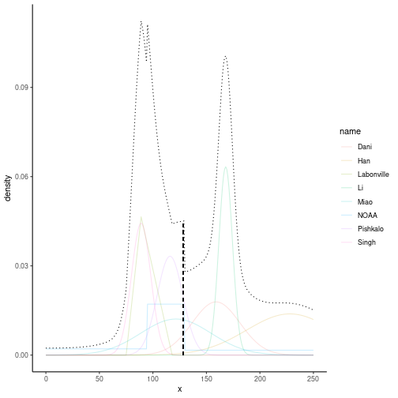
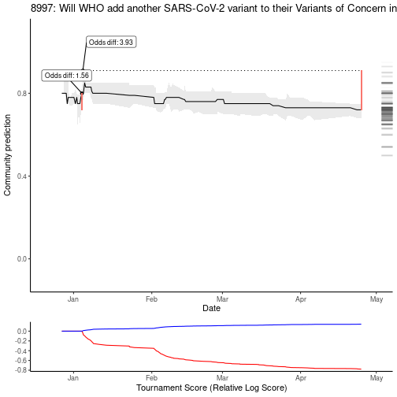
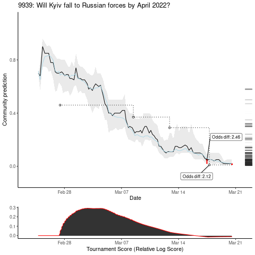
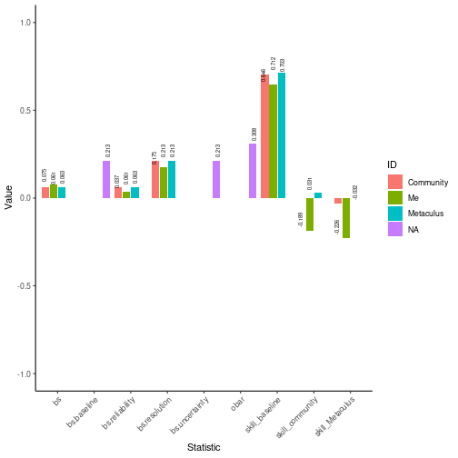
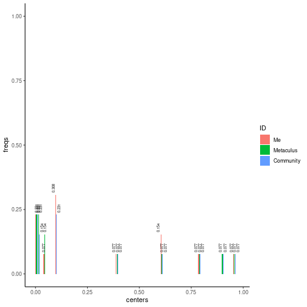
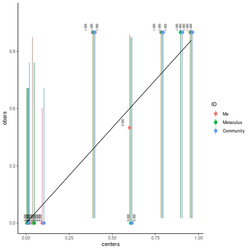

```r
library(MetaculR)
```


```r
Metaculus_response_login <- MetaculR_login()
```

# Improving current predictions

## Aggregate community's forecasts

Other Metaculus predictions provide a wealth of insight about a question, `MetaculR_myPredictions()` quickly puts together a number of summary statistics.


```r
questions_myPredictions <- MetaculR_myPredictions(guessed_by = Metaculus_response_login$Metaculus_user_id)
```


```r
MetaculR_aggregated_forecasts(questions_myPredictions, Metaculus_id = 8997) %>%
  knitr::kable()
```


|   ID| community_q2| community_ave| community_q2_unweighted| community_ave_unweighted| community_mean_logodds| community_mean_logodds_extremized_baseline|
|----:|------------:|-------------:|-----------------------:|------------------------:|----------------------:|------------------------------------------:|
| 8997|         0.72|     0.7213863|                    0.78|                0.7737288|              0.7291571|                                  0.8467761|

## Generate probabilistic consensus

Sometimes you find external forecasts relevant to your question, but how to combine them?
Using some work from McAndrew & Reich (2020), this provides a quick way to combine forecasts.

As an example, this question asked, [What will be the 13-month mean sunspot number for the year of Solar Cycle 25’s maximum?](https://www.metaculus.com/questions/4971/13-month-boxed-mean-of-sunspots-around-the-solar-25-maximum/) and Table 1 of ["The Next Solar Cycle"](https://www.thegwpf.org/content/uploads/2020/04/SolarCycle25.pdf) published a number of early forecasts.
Here you see that we combine forecasts using normal distributions as well as min-mode-max as well as 20p-80p forecasts.
Additionally, we gave Pishkalo a weight of 0.2 (while the others default to 1) so that their very narrow range doesn't dominate our consensus.


```r
forecasts <- list(list(range = c(0, 250), resolution = 1),
  list(source = "Pishkalo",
    dist = "Norm",
    params = c("mu", "sd"),
    values = c(116, 12),
    weight = 0.2),
  list(source = "Miao",
    dist = "Norm",
    params = c("mu", "sd"),
    values = c(121.5, 32.9)),
  list(source = "Labonville",
    dist = "TPD",
    params = c("min", "mode", "max"),
    values = c(89-14, 89, 89+29)),
  list(source = "NOAA",
    dist = "PCT",
    params = c(0.2, 0.8),
    values = c(95, 130)),
  list(source = "Han",
    dist = "Norm",
    params = c("mu", "sd"),
    values = c(228, 40.5)),
  list(source = "Dani",
    dist = "Norm",
    params = c("mu", "sd"),
    values = c(159, 22.3)),
  list(source = "Li",
    dist = "Norm",
    params = c("mu", "sd"),
    values = c(168, 6.3)),
  list(source = "Singh",
    dist = "Norm",
    params = c("mu", "sd"),
    values = c(89, 9)))

prob_consensus <- MetaculR_probabilistic_consensus(
  f = forecasts)

prob_consensus$summary %>%
  knitr::kable()
```


|     |source     | q10| q25| q50|       mu| q75| q90|
|:----|:----------|---:|---:|---:|--------:|---:|---:|
|10%  |Pishkalo   | 101| 108| 116| 116.0000| 124| 131|
|10%1 |Miao       |  79|  99| 122| 121.5075| 144| 164|
|10%2 |Labonville |  83|  87|  93|  94.0000| 100| 107|
|10%3 |NOAA       |  47|  97| 112| 114.6000| 127| 190|
|10%4 |Han        | 169| 191| 213| 208.5179| 231| 242|
|10%5 |Dani       | 130| 144| 159| 158.9980| 174| 188|
|10%6 |Li         | 160| 164| 168| 168.0000| 172| 176|
|10%7 |Singh      |  77|  83|  89|  89.0000|  95| 101|
|10%8 |agg        |  84|  95| 128| 135.8088| 170| 204|

You can also visualize it to help you improve your prediction.


```r
prob_consensus$pdf %>%
  tidyr::pivot_longer(cols = c(-x, -agg)) %>%
  ggplot2::ggplot() +
  ggplot2::geom_line(ggplot2::aes(x = x,
                                  y = value,
                                  color = name),
                     alpha = 0.2) +
  ggplot2::geom_line(ggplot2::aes(x = x,
                                  y = agg * (ncol(prob_consensus$pdf) - 2)), # 8 forecasters, make aggregated density appear larger in plot
                     linetype = "dotted") +
  ggplot2::geom_segment(ggplot2::aes(x = prob_consensus$summary$q50[nrow(prob_consensus$summary)],
                                     xend = prob_consensus$summary$q50[nrow(prob_consensus$summary)],
                                     y = 0,
                                     yend = prob_consensus$pdf$agg[which(prob_consensus$pdf$x == prob_consensus$summary$q50[nrow(prob_consensus$summary)])] * (ncol(prob_consensus$pdf) - 2)),
                        linetype = "dashed") +
  ggplot2::theme_classic() +
  ggplot2::labs(y = "density")
```




# Scoring

## Tournament Scoring

See your cumulative mean relative log score on questions where you have made predictions.
If the question is unresolved (or ambiguously resolved), see both "Yes" and "No" possibilities, otherwise see only the resolution possibility.


```r
MetaculR_plot(questions_myPredictions, 8997, tournament = TRUE)
```



Watch your tournament score rise and fall over time.


```r
MetaculR_plot(questions_myPredictions, 9939, tournament = TRUE)
```



## Score Predictions (Equivalent Evidentiary Bins)

What if question bins for histograms, calibration plots, etc. were not 10 percentage points each, but were based on logodds?
Use the `thresholds` argument of `MetaculR_brier()`.


```r
# questions_myPredictions_resolved <- MetaculR_myPredictions_Resolved(guessed_by = Metaculus_response_login$Metaculus_user_id)
```


```r
brier_me <- MetaculR_brier(questions_myPredictions,
                           thresholds = c(0, exp(seq(from = -log(99), to = log(99), by = log(99) / 5)) / (exp(seq(from = -log(99), to = log(99), by = log(99) / 5)) + 1), 1))
#> Warning in x$results$possibilities$type == "binary" & !is.na(x$results$resolution) & : longer object length is not a multiple
#> of shorter object length

#> Warning in x$results$possibilities$type == "binary" & !is.na(x$results$resolution) & : longer object length is not a multiple
#> of shorter object length

#> Warning in x$results$possibilities$type == "binary" & !is.na(x$results$resolution) & : longer object length is not a multiple
#> of shorter object length

#> Warning in x$results$possibilities$type == "binary" & !is.na(x$results$resolution) & : longer object length is not a multiple
#> of shorter object length

#> Warning in x$results$possibilities$type == "binary" & !is.na(x$results$resolution) & : longer object length is not a multiple
#> of shorter object length

#> Warning in x$results$possibilities$type == "binary" & !is.na(x$results$resolution) & : longer object length is not a multiple
#> of shorter object length

#> Warning in x$results$possibilities$type == "binary" & !is.na(x$results$resolution) & : longer object length is not a multiple
#> of shorter object length

#> Warning in x$results$possibilities$type == "binary" & !is.na(x$results$resolution) & : longer object length is not a multiple
#> of shorter object length
```


```r
brier_me$brier_df  %>%
  ggplot2::ggplot() +
  ggplot2::geom_col(
    ggplot2::aes(x = name,
                 y = value,
                 fill = ID),
    position = "dodge2"
  ) +
  ggplot2::geom_text(
    ggplot2::aes(x = name,
                 y = value,
                 label = round(value, 3)),
    size = 2,
    position = ggplot2::position_dodge2(width = 1), #"dodge2",
    vjust = 0.5,
    hjust = -0.25,
    angle = 90) +
  ggplot2::theme_classic() +
  ggplot2::labs(x = "Statistic",
                y = "Value") +
  ggplot2::coord_cartesian(ylim = c(-1, 1)) +
  ggplot2::theme(axis.text.x = ggplot2::element_text(angle = 45, vjust = 1, hjust = 1))
#> Warning: Removed 17 rows containing missing values (geom_col).
#> Warning: Removed 17 rows containing missing values (geom_text).
```



#### Histogram (Equivalent Evidentiary Bins)


```r
brier_me$brier_bins_df %>%
  ggplot2::ggplot() +
  ggplot2::geom_col(
    ggplot2::aes(x = centers,
                 y = freqs,
                 fill = ID),
    position = ggplot2::position_dodge2(width = 0.1, preserve = "single")
  ) +
  ggplot2::geom_text(
    ggplot2::aes(x = centers,
                 y = freqs,
                 label = round(freqs, 3)),
    size = 2,
    position = ggplot2::position_dodge2(width = 0.05), #"dodge2",
    # vjust = 0.5,
    hjust = -0.25,
    angle = 90) +
  ggplot2::theme_classic() +
  ggplot2::coord_cartesian(ylim = c(0, 1))
```



#### Calibration (Equivalent Evidentiary Bins)


```r
brier_me$brier_bins_df %>%
  ggplot2::ggplot() +
  ggplot2::geom_pointrange(
    ggplot2::aes(x = centers,
                 y = obars,
                 ymin = ci_low,
                 ymax = ci_high,
                 color = ID),
    position = ggplot2::position_dodge2(width = 0.02)
  ) +
  ggplot2::geom_line(
    ggplot2::aes(x = centers,
                 y = ideal)
  ) +
  ggplot2::geom_text(
    ggplot2::aes(x = centers,
                 y = obars,
                 label = format(round(obars, 3), nsmall = 3)),
    size = 2,
    position = ggplot2::position_dodge2(width = 0.1), #"dodge2",
    vjust = -0.5,
    hjust = -0.25,
    angle = 90) +
  ggplot2::theme_classic() +
  ggplot2::coord_cartesian(ylim = c(0, max(brier_me$brier_bins_df$obars) * 1.1))
```


