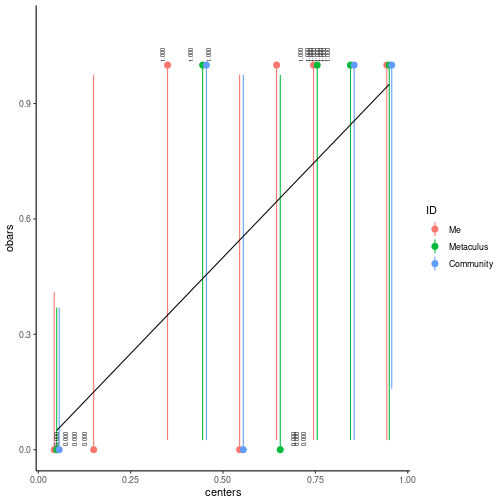
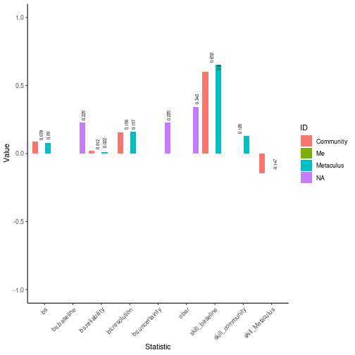
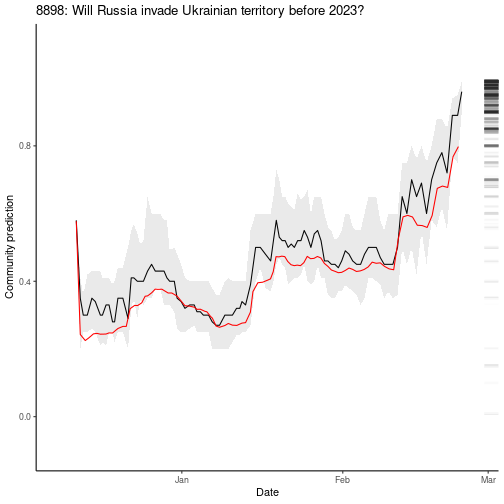

```r
library(MetaculR)
```

# Login

Add the following lines to `.Renviron` using `usethis::edit_r_environ()`:

```
Metaculus_username="yourUsername"
Metaculus_password="yourPassword"
```

Then, login:


```r
Metaculus_user_id <- MetaculR_login()
```

# Download Your Predictions


```r
questions_myPredictions <- MetaculR_myPredictions(guessed_by = Metaculus_user_id)
```

# Analyze Your Predictions

## How different is my last prediction from current community?


```r
questions_myPredictions_byDiff <- MetaculR_myDiff(questions_myPredictions)
```


```r
questions_myPredictions_byDiff %>%
  dplyr::select(id, title, my_prediction, community_q2, community_q2_pre_me, diff_me_q2_abs_odds) %>%
  dplyr::mutate(diff_me_q2_abs_odds = round(diff_me_q2_abs_odds, 1)) %>%
  dplyr::arrange(dplyr::desc(diff_me_q2_abs_odds)) %>%
  head() %>%
  knitr::kable()
```


|   id|title                                                                                 | my_prediction| community_q2| community_q2_pre_me| diff_me_q2_abs_odds|
|----:|:-------------------------------------------------------------------------------------|-------------:|------------:|-------------------:|-------------------:|
| 1634|Will US Income Inequality Increase by 2025?                                           |          0.02|         0.53|                0.47|                55.3|
| 9933|Will any NATO country invoke Article 5 by March 31, 2022?                             |          0.13|         0.01|                0.02|                14.8|
| 5407|If Starlink offers an IPO before 2030, will it set a record for the largest IPO?      |          0.03|         0.24|                0.30|                10.2|
| 9937|Will more than 50,000 people be killed in the Russo-Ukrainian War in 2022?            |          0.15|         0.60|                0.45|                 8.5|
| 2605|Will any country's military expenditure exceed that of the United States before 2030? |          0.01|         0.07|                0.08|                 7.5|
| 7977|Will US core CPI inflation rise by more than 3% from December 2021 to December 2022?  |          0.94|         0.70|                0.68|                 6.7|

### Plot those differences


```r
questions_myPredictions_byDiff %>%
  dplyr::arrange(dplyr::desc(diff_me_q2_abs_odds)) %>%
  dplyr::slice_head(n = 10) %>%
  ggplot2::ggplot() +
  ggplot2::geom_col(
    ggplot2::aes(x = reorder(factor(id), -diff_me_q2_abs_odds),
                 y = diff_me_q2_abs_odds,
                 fill = reorder(factor(id), -diff_me_q2_abs_odds))
  ) +
  ggplot2::theme_classic() +
  ggplot2::labs(x = "ID",
                y = "Odds difference between me and community q2") +
  ggplot2::guides(fill = FALSE) +
  ggplot2::theme(axis.text.x = ggplot2::element_text(angle = 45, vjust = 1, hjust = 1))
```


## Where has community moved most since my last prediction?


```r
questions_myPredictions_byDiff %>%
  dplyr::select(id, title, my_prediction, community_q2, community_q2_pre_me, diff_comm_q2_pre_me_abs_odds) %>%
  dplyr::mutate(diff_comm_q2_pre_me_abs_odds = round(diff_comm_q2_pre_me_abs_odds, 1)) %>%
  dplyr::arrange(dplyr::desc(diff_comm_q2_pre_me_abs_odds)) %>%
  head() %>%
  knitr::kable()
```


|    id|title                                                                         | my_prediction| community_q2| community_q2_pre_me| diff_comm_q2_pre_me_abs_odds|
|-----:|:-----------------------------------------------------------------------------|-------------:|------------:|-------------------:|----------------------------:|
| 10004|Will a major nuclear power plant in Germany be operational on June 1, 2023?   |          0.10|         0.20|                0.56|                          5.1|
|  9939|Will Kyiv fall to Russian forces by April 2022?                               |          0.01|         0.02|                0.09|                          4.8|
|  6604|Will annual U.S. inflation reach 100% in any year before 2050?                |          0.01|         0.02|                0.08|                          4.3|
|  8766|Will the Omicron variant be less lethal than Delta?                           |          0.98|         0.98|                0.94|                          3.1|
|  9933|Will any NATO country invoke Article 5 by March 31, 2022?                     |          0.13|         0.01|                0.02|                          2.0|
|  6725|Will a large American city fully abolish their police department before 2035? |          0.01|         0.02|                0.04|                          2.0|

### Plot those differences


```r
MetaculR_plot(MetaculR_questions = questions_myPredictions,
              Metacular_id = 10004)
```


```r
MetaculR_plot(MetaculR_questions = questions_myPredictions,
              Metacular_id = 6604,
              scale_binary = "logodds")
```


## Score Predictions

Let's see some Brier statistics on resolved questions:


```r
questions_myPredictions_resolved <- MetaculR_myPredictions_Resolved(guessed_by = Metaculus_user_id)
```


```r
brier_me <- MetaculR_brier(questions_myPredictions_resolved)
```

### Plot scores


```r
brier_me$brier_df %>%
  ggplot2::ggplot() +
  ggplot2::geom_col(
    ggplot2::aes(x = name,
                 y = value,
                 fill = ID),
    position = "dodge2"
  ) +
  ggplot2::geom_text(
    ggplot2::aes(x = name,
                 y = value,
                 label = round(value, 3)),
    size = 2,
    position = ggplot2::position_dodge2(width = 1), #"dodge2",
    vjust = 0.5,
    hjust = -0.25,
    angle = 90) +
  ggplot2::theme_classic() +
  ggplot2::labs(x = "Statistic",
                y = "Value") +
  ggplot2::coord_cartesian(ylim = c(0, 1)) +
  ggplot2::theme(axis.text.x = ggplot2::element_text(angle = 45, vjust = 1, hjust = 1))
#> Warning: Removed 10 rows containing missing values (geom_col).
#> Warning: Removed 10 rows containing missing values (geom_text).
```


#### Histogram


```r
brier_me$brier_bins_df %>%
  ggplot2::ggplot() +
  ggplot2::geom_col(
    ggplot2::aes(x = centers,
                 y = freqs,
                 fill = ID),
    position = ggplot2::position_dodge2(width = 0.1, preserve = "single")
  ) +
  ggplot2::geom_text(
    ggplot2::aes(x = centers,
                 y = freqs,
                 label = round(freqs, 3)),
    size = 2,
    position = ggplot2::position_dodge2(width = 0.1), #"dodge2",
    # vjust = 0.5,
    hjust = -0.25,
    angle = 90) +
  ggplot2::theme_classic() +
  ggplot2::coord_cartesian(ylim = c(0, 1))
```


#### Calibration


```r
brier_me$brier_bins_df %>%
  ggplot2::ggplot() +
  ggplot2::geom_pointrange(
    ggplot2::aes(x = centers,
                 y = obars,
                 ymin = ci_low,
                 ymax = ci_high,
                 color = ID),
    position = ggplot2::position_dodge2(width = 0.02)
  ) +
  ggplot2::geom_line(
    ggplot2::aes(x = centers,
                 y = ideal)
  ) +
  ggplot2::geom_text(
    ggplot2::aes(x = centers,
                 y = obars,
                 label = format(round(obars, 3), nsmall = 3)),
    size = 2,
    position = ggplot2::position_dodge2(width = 0.1), #"dodge2",
    vjust = -0.5,
    hjust = -0.25,
    angle = 90) +
  ggplot2::theme_classic() +
  ggplot2::coord_cartesian(ylim = c(0, max(brier_me$brier_bins_df $obars) * 1.1))
```



## Score Predictions (Equivalent Evidentiary Bins)

What if question bins were not 5 percentage points each, but were based on logodds?


```r
brier_me <- MetaculR_brier(questions_myPredictions_resolved,
                           thresholds = c(0, exp(seq(from = -log(99), to = log(99), by = log(99) / 5)) / (exp(seq(from = -log(99), to = log(99), by = log(99) / 5)) + 1), 1))
```


```r
brier_me$brier_df  %>%
  ggplot2::ggplot() +
  ggplot2::geom_col(
    ggplot2::aes(x = name,
                 y = value,
                 fill = ID),
    position = "dodge2"
  ) +
  ggplot2::geom_text(
    ggplot2::aes(x = name,
                 y = value,
                 label = round(value, 3)),
    size = 2,
    position = ggplot2::position_dodge2(width = 1), #"dodge2",
    vjust = 0.5,
    hjust = -0.25,
    angle = 90) +
  ggplot2::theme_classic() +
  ggplot2::labs(x = "Statistic",
                y = "Value") +
  ggplot2::coord_cartesian(ylim = c(0, 1)) +
  ggplot2::theme(axis.text.x = ggplot2::element_text(angle = 45, vjust = 1, hjust = 1))
#> Warning: Removed 10 rows containing missing values (geom_col).
#> Warning: Removed 10 rows containing missing values (geom_text).
```


#### Histogram (Equivalent Evidentiary Bins)


```r
brier_me$brier_bins_df %>%
  ggplot2::ggplot() +
  ggplot2::geom_col(
    ggplot2::aes(x = centers,
                 y = freqs,
                 fill = ID),
    position = ggplot2::position_dodge2(width = 0.1, preserve = "single")
  ) +
  ggplot2::geom_text(
    ggplot2::aes(x = centers,
                 y = freqs,
                 label = round(freqs, 3)),
    size = 2,
    position = ggplot2::position_dodge2(width = 0.05), #"dodge2",
    # vjust = 0.5,
    hjust = -0.25,
    angle = 90) +
  ggplot2::theme_classic() +
  ggplot2::coord_cartesian(ylim = c(0, 1))
```



#### Calibration (Equivalent Evidentiary Bins)


```r
brier_me$brier_bins_df %>%
  ggplot2::ggplot() +
  ggplot2::geom_pointrange(
    ggplot2::aes(x = centers,
                 y = obars,
                 ymin = ci_low,
                 ymax = ci_high,
                 color = ID),
    position = ggplot2::position_dodge2(width = 0.02)
  ) +
  ggplot2::geom_line(
    ggplot2::aes(x = centers,
                 y = ideal)
  ) +
  ggplot2::geom_text(
    ggplot2::aes(x = centers,
                 y = obars,
                 label = format(round(obars, 3), nsmall = 3)),
    size = 2,
    position = ggplot2::position_dodge2(width = 0.1), #"dodge2",
    vjust = -0.5,
    hjust = -0.25,
    angle = 90) +
  ggplot2::theme_classic() +
  ggplot2::coord_cartesian(ylim = c(0, max(brier_me$brier_bins_df$obars) * 1.1))
```


# Analyze community predictions

For questions you may not have predicted.

## Score, Community Predictions

Let's see some Brier statistics on resolved questions:


```r
questions_recent_resolved <-
  MetaculR_questions(
    order_by = "-resolve_time",
    status= "resolved",
    guessed_by = "",
    pages = 32,
    offset = 0)
```


```r
brier_recent_resolved <-
  MetaculR_brier(
    questions_recent_resolved,
    me = FALSE)
```

### Plot scores, Community Predictions


```r
brier_recent_resolved$brier_df %>%
    ggplot2::ggplot() +
  ggplot2::geom_col(
    ggplot2::aes(x = name,
                 y = value,
                 fill = ID),
    position = "dodge2"
  ) +
  ggplot2::geom_text(
    ggplot2::aes(x = name,
                 y = value,
                 label = round(value, 3)),
    size = 2,
    position = ggplot2::position_dodge2(width = 1), #"dodge2",
    vjust = 0.5,
    hjust = -0.25,
    angle = 90) +
  ggplot2::theme_classic() +
  ggplot2::labs(x = "Statistic",
                y = "Value") +
  ggplot2::coord_cartesian(ylim = c(0, 1)) +
  ggplot2::theme(axis.text.x = ggplot2::element_text(angle = 45, vjust = 1, hjust = 1))
#> Warning: Removed 17 rows containing missing values (geom_col).
#> Warning: Removed 17 rows containing missing values (geom_text).
```


#### Histogram, Community Predictions


```r
brier_recent_resolved$brier_bins_df %>%
  ggplot2::ggplot() +
  ggplot2::geom_col(
    ggplot2::aes(x = centers,
                 y = freqs)
  ) +
  ggplot2::geom_text(
    ggplot2::aes(x = centers,
                 y = freqs,
                 label = round(freqs, 3)),
    size = 2,
    # position = ggplot2::position_dodge2(width = 0.1), #"dodge2",
    # vjust = 0.5,
    hjust = -0.25,
    angle = 90) +
  ggplot2::theme_classic() +
  ggplot2::coord_cartesian(ylim = c(0, max(brier_recent_resolved$brier_bins_df$freqs) * 1.1))
```


#### Calibration, Community Predictions


```r
brier_recent_resolved$brier_bins_df %>%
  ggplot2::ggplot() +
  ggplot2::geom_pointrange(
    ggplot2::aes(x = centers,
                 y = obars,
                 ymin = ci_low,
                 ymax = ci_high)
  ) +
  ggplot2::geom_line(
    ggplot2::aes(x = centers,
                 y = ideal)
  ) +
  ggplot2::geom_text(
    ggplot2::aes(x = centers,
                 y = obars,
                 label = format(round(obars, 3), nsmall = 3)),
    size = 2,
    # position = ggplot2::position_dodge2(width = 0.1), #"dodge2",
    vjust = -0.5,
    hjust = -0.25,
    angle = 90) +
  ggplot2::theme_classic() +
  ggplot2::coord_cartesian(ylim = c(0, max(brier_recent_resolved$brier_bins_df$obars) * 1.1))
```


## Score Predictions, Community Predictions (Equivalent Evidentiary Bins)


```r
brier_recent_resolved <-
  MetaculR_brier(
    questions_recent_resolved,
    me = FALSE,
    thresholds = c(0, exp(seq(from = -log(99), to = log(99), by = log(99) / 5)) / (exp(seq(from = -log(99), to = log(99), by = log(99) / 5)) + 1), 1))
```


```r
brier_recent_resolved$brier_df %>%
  ggplot2::ggplot() +
  ggplot2::geom_col(
    ggplot2::aes(x = name,
                 y = value,
                 fill = ID),
    position = "dodge2"
  ) +
  ggplot2::geom_text(
    ggplot2::aes(x = name,
                 y = value,
                 label = round(value, 3)),
    size = 2,
    position = ggplot2::position_dodge2(width = 1), #"dodge2",
    vjust = 0.5,
    hjust = -0.25,
    angle = 90) +
  ggplot2::theme_classic() +
  ggplot2::labs(x = "Statistic",
                y = "Value") +
  ggplot2::coord_cartesian(ylim = c(0, 1)) +
  ggplot2::theme(axis.text.x = ggplot2::element_text(angle = 45, vjust = 1, hjust = 1))
#> Warning: Removed 17 rows containing missing values (geom_col).
#> Warning: Removed 17 rows containing missing values (geom_text).
```



#### Histogram, Community Predictions (Equivalent Evidentiary Bins)


```r
brier_recent_resolved$brier_bins_df %>%
  ggplot2::ggplot() +
  ggplot2::geom_col(
    ggplot2::aes(x = centers,
                 y = freqs)
  ) +
  ggplot2::geom_text(
    ggplot2::aes(x = centers,
                 y = freqs,
                 label = round(freqs, 3)),
    size = 2,
    # position = ggplot2::position_dodge2(width = 0.1), #"dodge2",
    # vjust = 0.5,
    hjust = -0.25,
    angle = 90) +
  ggplot2::theme_classic() +
  ggplot2::coord_cartesian(ylim = c(0, max(brier_recent_resolved$brier_bins_df$freqs) * 1.1))
```


#### Calibration, Community Predictions (Equivalent Evidentiary Bins)


```r
brier_recent_resolved$brier_bins_df %>%
  ggplot2::ggplot() +
  ggplot2::geom_pointrange(
    ggplot2::aes(x = centers,
                 y = obars,
                 ymin = ci_low,
                 ymax = ci_high)
  ) +
  ggplot2::geom_line(
    ggplot2::aes(x = centers,
                 y = ideal)
  ) +
  ggplot2::geom_text(
    ggplot2::aes(x = centers,
                 y = obars,
                 label = format(round(obars, 3), nsmall = 3)),
    size = 2,
    # position = ggplot2::position_dodge2(width = 0.1), #"dodge2",
    vjust = -0.5,
    hjust = -0.25,
    angle = 90) +
  ggplot2::theme_classic() +
  ggplot2::coord_cartesian(ylim = c(0, max(brier_recent_resolved$brier_bins_df$obars) * 1.1))
```


# Find Exciting Questions

Various sports now have an "Excitement Index" to identify games that interest fans--maybe we can do the same for predictions?

## Among your predictions


```r
questions_myPredictions_byExcitement <- MetaculR_excitement(questions_myPredictions)

questions_myPredictions_byExcitement %>%
  dplyr::mutate(Total_logodds_Change = round(Total_logodds_Change, 2),
                Total_logodds_Change_Even = round(Total_logodds_Change_Even, 2)) %>%
  dplyr::arrange(dplyr::desc(Total_Change)) %>%
  head() %>%
  knitr::kable()
```


|   id|title                                                                             | Total_Change| Total_logodds_Change| Total_Change_Even| Total_logodds_Change_Even|
|----:|:---------------------------------------------------------------------------------|------------:|--------------------:|-----------------:|-------------------------:|
| 9790|Will Éric Zemmour be in the 2nd round of the 2022 French presidential election?   |         1.12|                 5.38|              0.50|                      2.32|
| 8944|Will Boris Johnson be Prime Minister of the UK on June 1, 2022?                   |         0.35|                 2.00|              0.00|                      0.00|
| 8882|Will 2022 be the hottest year on record?                                          |         0.22|                 1.60|              0.11|                      0.80|
| 8554|Will women receive at least 70% of bachelor's degrees in the US in the year 2050? |         0.19|                 1.49|              0.10|                      0.79|
| 2511|Will Emmanuel Macron be re-elected President of France in 2022?                   |         0.18|                 1.40|              0.00|                      0.00|
| 6330|Will Donald J. Trump be a candidate for President in the 2024 cycle?              |         0.15|                 0.79|              0.05|                      0.25|


```r
MetaculR_plot(MetaculR_questions = questions_myPredictions,
              Metacular_id = 9790)
```


```r
questions_myPredictions_byExcitement %>%
  dplyr::mutate(Total_logodds_Change = round(Total_logodds_Change, 2),
                Total_logodds_Change_Even = round(Total_logodds_Change_Even, 2)) %>%
  dplyr::arrange(dplyr::desc(Total_logodds_Change)) %>%
  head() %>%
  knitr::kable()
```


|   id|title                                                                             | Total_Change| Total_logodds_Change| Total_Change_Even| Total_logodds_Change_Even|
|----:|:---------------------------------------------------------------------------------|------------:|--------------------:|-----------------:|-------------------------:|
| 9790|Will Éric Zemmour be in the 2nd round of the 2022 French presidential election?   |         1.12|                 5.38|              0.50|                      2.32|
| 8944|Will Boris Johnson be Prime Minister of the UK on June 1, 2022?                   |         0.35|                 2.00|              0.00|                      0.00|
| 8882|Will 2022 be the hottest year on record?                                          |         0.22|                 1.60|              0.11|                      0.80|
| 8554|Will women receive at least 70% of bachelor's degrees in the US in the year 2050? |         0.19|                 1.49|              0.10|                      0.79|
| 6604|Will annual U.S. inflation reach 100% in any year before 2050?                    |         0.06|                 1.45|              0.00|                      0.00|
| 2511|Will Emmanuel Macron be re-elected President of France in 2022?                   |         0.18|                 1.40|              0.00|                      0.00|


```r
MetaculR_plot(MetaculR_questions = questions_myPredictions,
              Metacular_id = 6725)
```


## Among community predictions

### Resolved questions

What were the most exciting resolved questions?


```r
questions_recent_byExcitement <- MetaculR_excitement(questions_recent_resolved)

questions_recent_byExcitement %>%
  dplyr::mutate(Total_logodds_Change = round(Total_logodds_Change, 2),
                Total_logodds_Change_Even = round(Total_logodds_Change_Even, 2)) %>%
  dplyr::arrange(dplyr::desc(Total_Change_Even)) %>%
  head() %>%
  knitr::kable()
```


|   id|title                                                                                                                | Total_Change| Total_logodds_Change| Total_Change_Even| Total_logodds_Change_Even|
|----:|:--------------------------------------------------------------------------------------------------------------------|------------:|--------------------:|-----------------:|-------------------------:|
| 8859|Will Ukraine ban wheat export before April 2023?                                                                     |         0.17|                 1.37|              0.11|                      0.92|
| 9517|Will Russian troops enter Mariupol, Ukraine by December 31, 2022?                                                    |         0.52|                 4.86|              0.09|                      0.44|
| 9590|Will there be a Pi variant of COVID by Pi Day (March 14, 2022)?                                                      |         0.41|                 1.95|              0.07|                      0.30|
| 8898|Will Russia invade Ukrainian territory before 2023?                                                                  |         0.38|                 2.97|              0.06|                      0.32|
| 7211|Will any body of the US federal government conclude that COVID-19 originated in a lab in Hubei before June 1st 2022? |         0.02|                 0.08|              0.02|                      0.08|
| 9693|Will the gray wolf be relisted as Threatened or Endangered by the US before 2030?                                    |         0.00|                 0.00|              0.00|                      0.00|


```r
MetaculR_plot(MetaculR_questions = questions_recent_resolved,
              Metacular_id = 8898)
```


### Open questions

What are the most exciting questions that are still open?


```r
questions_recent_open <-
  MetaculR_questions(
    order_by = "close_time",
    status = "open",
    guessed_by = "")
```


```r
questions_recent_open_byExcitement <- MetaculR_excitement(questions_recent_open)

questions_recent_open_byExcitement %>%
  dplyr::mutate(Total_logodds_Change = round(Total_logodds_Change, 2),
                Total_logodds_Change_Even = round(Total_logodds_Change_Even, 2)) %>%
  dplyr::arrange(dplyr::desc(Total_logodds_Change_Even)) %>%
  head() %>%
  knitr::kable()
```


|   id|title                                                                                                  | Total_Change| Total_logodds_Change| Total_Change_Even| Total_logodds_Change_Even|
|----:|:------------------------------------------------------------------------------------------------------|------------:|--------------------:|-----------------:|-------------------------:|
| 9746|Will Ukraine fulfill its Minsk-II obligations in Donetsk and Luhansk Oblast by 2023?                   |         0.57|                11.73|              0.14|                      4.72|
| 9566|Will Russian troops enter Odessa, Ukraine before December 31, 2022?                                    |         1.18|                10.03|              0.48|                      4.56|
| 9791|Will Éric Zemmour win the French presidential election in 2022?                                        |         0.15|                 9.40|              0.07|                      4.35|
| 9743|Will Volodymyr Zelensky remain President of Ukraine by 2023?                                           |         1.66|                 8.13|              0.74|                      3.70|
| 7237|Will Coinbase default on an obligation to hand over their users’ assets on request by the end of 2022? |         0.13|                 5.05|              0.07|                      2.67|
| 9584|Will Ketanji Brown Jackson be confirmed as an Associate Justice of the Supreme Court before 2023?      |         0.67|                 8.62|              0.12|                      2.46|


```r
MetaculR_plot(MetaculR_questions = questions_recent_open,
              Metacular_id = 9566)
```


