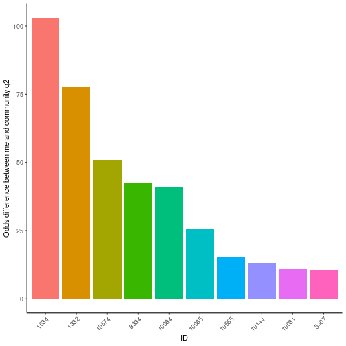
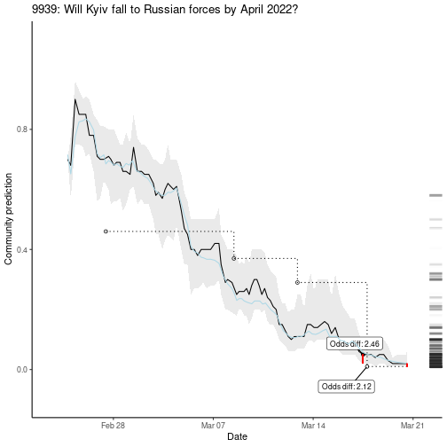
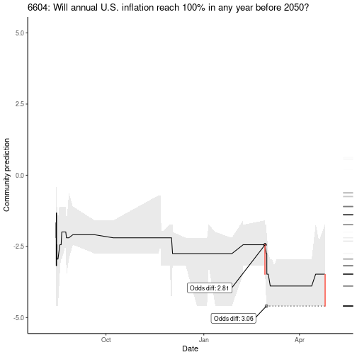
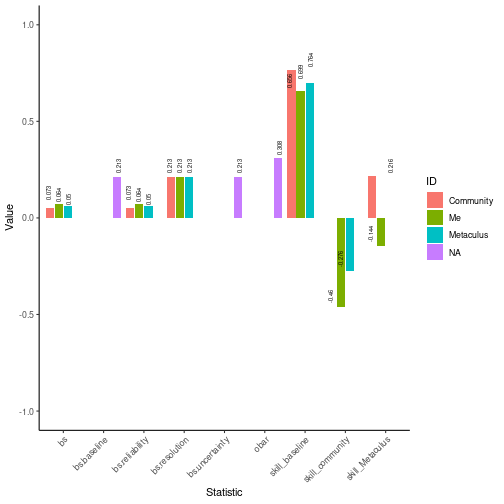
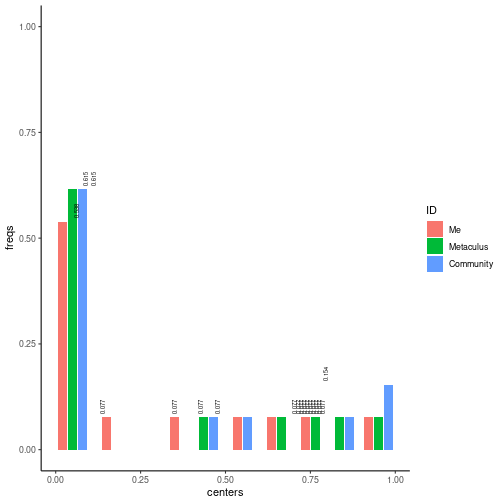
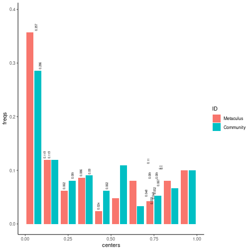
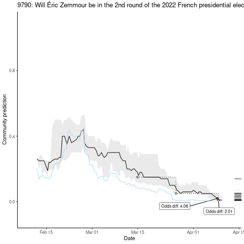
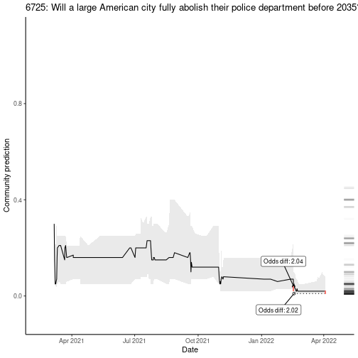
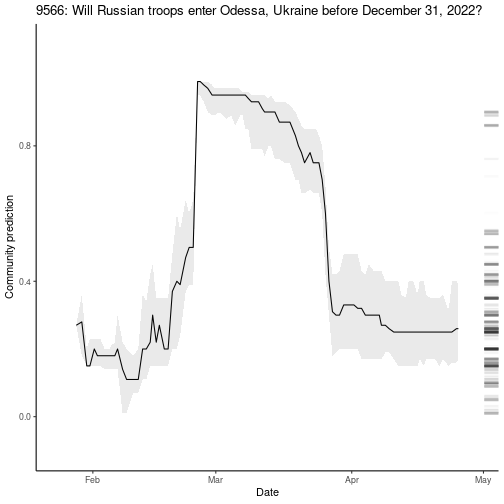

```r
library(MetaculR)
```

# Login

Add the following lines to `.Renviron` using `usethis::edit_r_environ()`:

```
Metaculus_username="yourUsername"
Metaculus_password="yourPassword"
```

Then, login:


```r
Metaculus_response_login <- MetaculR_login()
```

# Download Your Predictions


```r
questions_myPredictions <- MetaculR_myPredictions(guessed_by = Metaculus_response_login$Metaculus_user_id)
```

# Analyze Your Predictions

## How different is my last prediction from current community?


```r
questions_myPredictions_byDiff <- MetaculR_myDiff(questions_myPredictions)
```


```r
questions_myPredictions_byDiff %>%
  dplyr::select(id, title, my_prediction, community_q2, community_q2_pre_me, diff_me_q2_abs_odds) %>%
  dplyr::mutate(diff_me_q2_abs_odds = round(diff_me_q2_abs_odds, 1)) %>%
  dplyr::arrange(dplyr::desc(diff_me_q2_abs_odds)) %>%
  head() %>%
  knitr::kable()
```


|    id|title                                                                                         | my_prediction| community_q2| community_q2_pre_me| diff_me_q2_abs_odds|
|-----:|:---------------------------------------------------------------------------------------------|-------------:|------------:|-------------------:|-------------------:|
|  1634|Will US Income Inequality Increase by 2025?                                                   |          0.01|         0.51|                0.53|               103.0|
|  1332|Will global malaria mortality rates be reduced by 90% when compared with 2015 rates, by 2030? |          0.01|         0.44|                0.46|                77.8|
| 10574|Will a 8-year gross world product doubling complete before a 2-year doubling does?            |          0.99|         0.66|                0.75|                51.0|
|  8334|Will spending on US office construction be less than $77 Billion USD in 2022?                 |          0.01|         0.30|                0.30|                42.4|
| 10084|Will Sweden join NATO before 2024?                                                            |          0.14|         0.87|                0.42|                41.1|
| 10085|Will Finland join NATO before 2024?                                                           |          0.26|         0.90|                0.83|                25.6|

### Plot those differences


```r
questions_myPredictions_byDiff %>%
  dplyr::arrange(dplyr::desc(diff_me_q2_abs_odds)) %>%
  dplyr::slice_head(n = 10) %>%
  ggplot2::ggplot() +
  ggplot2::geom_col(
    ggplot2::aes(x = reorder(factor(id), -diff_me_q2_abs_odds),
                 y = diff_me_q2_abs_odds,
                 fill = reorder(factor(id), -diff_me_q2_abs_odds))
  ) +
  ggplot2::theme_classic() +
  ggplot2::labs(x = "ID",
                y = "Odds difference between me and community q2") +
  ggplot2::guides(fill = FALSE) +
  ggplot2::theme(axis.text.x = ggplot2::element_text(angle = 45, vjust = 1, hjust = 1))
```



## Where has community moved most since my last prediction?


```r
questions_myPredictions_byDiff %>%
  dplyr::select(id, title, my_prediction, community_q2, community_q2_pre_me, diff_comm_q2_pre_me_abs_odds) %>%
  dplyr::mutate(diff_comm_q2_pre_me_abs_odds = round(diff_comm_q2_pre_me_abs_odds, 1)) %>%
  dplyr::arrange(dplyr::desc(diff_comm_q2_pre_me_abs_odds)) %>%
  head() %>%
  knitr::kable()
```


|    id|title                                                                                 | my_prediction| community_q2| community_q2_pre_me| diff_comm_q2_pre_me_abs_odds|
|-----:|:-------------------------------------------------------------------------------------|-------------:|------------:|-------------------:|----------------------------:|
| 10084|Will Sweden join NATO before 2024?                                                    |          0.14|         0.87|                0.42|                          9.2|
|  9994|Will at least 5 million refugees from Ukraine seek assistance from other countries?   |          0.99|         0.99|                0.94|                          6.3|
| 10057|Will Russia control  Chernihiv on June 1, 2022?                                       |          0.01|         0.01|                0.05|                          5.2|
| 10667|Will Elon Musk hold major political office in the United States before February 2033? |          0.01|         0.04|                0.16|                          4.6|
| 10004|Will a major nuclear power plant in Germany be operational on June 1, 2023?           |          0.10|         0.25|                0.55|                          3.7|
| 10492|Will Mariupol be under Russian control on June 1, 2022?                               |          0.99|         0.95|                0.85|                          3.4|

### Plot those differences


```r
MetaculR_plot(MetaculR_questions = questions_myPredictions,
              Metaculus_id = 9939)
```




```r
MetaculR_plot(MetaculR_questions = questions_myPredictions,
              Metaculus_id = 6604,
              scale_binary = "logodds")
```



## Score Predictions

Let's see some Brier statistics on resolved questions:


```r
# questions_myPredictions_resolved <- MetaculR_myPredictions_Resolved(guessed_by = Metaculus_response_login$Metaculus_user_id)
```


```r
brier_me <- MetaculR_brier(questions_myPredictions)
#> Warning in x$results$possibilities$type == "binary" & !is.na(x$results$resolution) & : longer object length is not a multiple
#> of shorter object length

#> Warning in x$results$possibilities$type == "binary" & !is.na(x$results$resolution) & : longer object length is not a multiple
#> of shorter object length

#> Warning in x$results$possibilities$type == "binary" & !is.na(x$results$resolution) & : longer object length is not a multiple
#> of shorter object length

#> Warning in x$results$possibilities$type == "binary" & !is.na(x$results$resolution) & : longer object length is not a multiple
#> of shorter object length

#> Warning in x$results$possibilities$type == "binary" & !is.na(x$results$resolution) & : longer object length is not a multiple
#> of shorter object length

#> Warning in x$results$possibilities$type == "binary" & !is.na(x$results$resolution) & : longer object length is not a multiple
#> of shorter object length

#> Warning in x$results$possibilities$type == "binary" & !is.na(x$results$resolution) & : longer object length is not a multiple
#> of shorter object length

#> Warning in x$results$possibilities$type == "binary" & !is.na(x$results$resolution) & : longer object length is not a multiple
#> of shorter object length
```

### Plot scores


```r
brier_me$brier_df %>%
  ggplot2::ggplot() +
  ggplot2::geom_col(
    ggplot2::aes(x = name,
                 y = value,
                 fill = ID),
    position = "dodge2"
  ) +
  ggplot2::geom_text(
    ggplot2::aes(x = name,
                 y = value,
                 label = round(value, 3)),
    size = 2,
    position = ggplot2::position_dodge2(width = 1), #"dodge2",
    vjust = 0.5,
    hjust = -0.25,
    angle = 90) +
  ggplot2::theme_classic() +
  ggplot2::labs(x = "Statistic",
                y = "Value") +
  ggplot2::coord_cartesian(ylim = c(-1, 1)) +
  ggplot2::theme(axis.text.x = ggplot2::element_text(angle = 45, vjust = 1, hjust = 1))
#> Warning: Removed 17 rows containing missing values (geom_col).
#> Warning: Removed 17 rows containing missing values (geom_text).
```



#### Histogram


```r
brier_me$brier_bins_df %>%
  ggplot2::ggplot() +
  ggplot2::geom_col(
    ggplot2::aes(x = centers,
                 y = freqs,
                 fill = ID),
    position = ggplot2::position_dodge2(width = 0.1, preserve = "single")
  ) +
  ggplot2::geom_text(
    ggplot2::aes(x = centers,
                 y = freqs,
                 label = round(freqs, 3)),
    size = 2,
    position = ggplot2::position_dodge2(width = 0.1), #"dodge2",
    # vjust = 0.5,
    hjust = -0.25,
    angle = 90) +
  ggplot2::theme_classic() +
  ggplot2::coord_cartesian(ylim = c(0, 1))
```



#### Calibration


```r
brier_me$brier_bins_df %>%
  ggplot2::ggplot() +
  ggplot2::geom_pointrange(
    ggplot2::aes(x = centers,
                 y = obars,
                 ymin = ci_low,
                 ymax = ci_high,
                 color = ID),
    position = ggplot2::position_dodge2(width = 0.02)
  ) +
  ggplot2::geom_line(
    ggplot2::aes(x = centers,
                 y = ideal)
  ) +
  ggplot2::geom_text(
    ggplot2::aes(x = centers,
                 y = obars,
                 label = format(round(obars, 3), nsmall = 3)),
    size = 2,
    position = ggplot2::position_dodge2(width = 0.1), #"dodge2",
    vjust = -0.5,
    hjust = -0.25,
    angle = 90) +
  ggplot2::theme_classic() +
  ggplot2::coord_cartesian(ylim = c(0, max(brier_me$brier_bins_df $obars) * 1.1))
```


# Analyze community predictions

For questions you may not have predicted.

## Score, Community Predictions

Let's see some Brier statistics on resolved questions:


```r
questions_recent_resolved <-
  MetaculR_questions(
    order_by = "-resolve_time",
    status= "resolved",
    guessed_by = "",
    pages = 32,
    offset = 0)
```


```r
brier_recent_resolved <-
  MetaculR_brier(
    questions_recent_resolved,
    me = FALSE)
```

### Plot scores, Community Predictions


```r
brier_recent_resolved$brier_df %>%
    ggplot2::ggplot() +
  ggplot2::geom_col(
    ggplot2::aes(x = name,
                 y = value,
                 fill = ID),
    position = "dodge2"
  ) +
  ggplot2::geom_text(
    ggplot2::aes(x = name,
                 y = value,
                 label = round(value, 3)),
    size = 2,
    position = ggplot2::position_dodge2(width = 1), #"dodge2",
    vjust = 0.5,
    hjust = -0.25,
    angle = 90) +
  ggplot2::theme_classic() +
  ggplot2::labs(x = "Statistic",
                y = "Value") +
  ggplot2::coord_cartesian(ylim = c(-1, 1)) +
  ggplot2::theme(axis.text.x = ggplot2::element_text(angle = 45, vjust = 1, hjust = 1))
#> Warning: Removed 23 rows containing missing values (geom_col).
#> Warning: Removed 23 rows containing missing values (geom_text).
```


#### Histogram, Community Predictions


```r
brier_recent_resolved$brier_bins_df %>%
  ggplot2::ggplot() +
  ggplot2::geom_col(
    ggplot2::aes(x = centers,
                 y = freqs,
                 fill = ID),
    position = ggplot2::position_dodge2(width = 0.1)
  ) +
  ggplot2::geom_text(
    ggplot2::aes(x = centers,
                 y = freqs,
                 label = round(freqs, 3)),
    size = 2,
    position = ggplot2::position_dodge2(width = 0.1), #"dodge2",
    # vjust = 0.5,
    hjust = -0.25,
    angle = 90) +
  ggplot2::theme_classic() +
  ggplot2::coord_cartesian(ylim = c(0, max(brier_recent_resolved$brier_bins_df$freqs) * 1.1))
```



#### Calibration, Community Predictions


```r
brier_recent_resolved$brier_bins_df %>%
  ggplot2::ggplot() +
  ggplot2::geom_pointrange(
    ggplot2::aes(x = centers,
                 y = obars,
                 ymin = ci_low,
                 ymax = ci_high,
                 color = ID),
    position = ggplot2::position_dodge2(width = 0.02)
  ) +
  ggplot2::geom_line(
    ggplot2::aes(x = centers,
                 y = ideal)
  ) +
  ggplot2::geom_text(
    ggplot2::aes(x = centers,
                 y = obars,
                 label = format(round(obars, 3), nsmall = 3)),
    size = 2,
    position = ggplot2::position_dodge2(width = 0.02), #"dodge2",
    vjust = -0.5,
    hjust = -0.25,
    angle = 90) +
  ggplot2::theme_classic() +
  ggplot2::coord_cartesian(ylim = c(0, max(brier_recent_resolved$brier_bins_df$obars) * 1.1))
```


# Find Exciting Questions

Various sports now have an "Excitement Index" to identify games that interest fans--maybe we can do the same for predictions?

## Among your predictions


```r
questions_myPredictions_byExcitement <- MetaculR_excitement(questions_myPredictions)

questions_myPredictions_byExcitement %>%
  dplyr::mutate(Total_logodds_Change = round(Total_logodds_Change, 2),
                Total_logodds_Change_Even = round(Total_logodds_Change_Even, 2)) %>%
  dplyr::arrange(dplyr::desc(Total_Change)) %>%
  head() %>%
  knitr::kable()
```


|    id|title                                                                               | Total_Change| Total_logodds_Change| Total_Change_Even| Total_logodds_Change_Even|
|-----:|:-----------------------------------------------------------------------------------|------------:|--------------------:|-----------------:|-------------------------:|
| 10448|Will Russia use chemical weapons in Ukraine in 2022?                                |         2.03|                 9.17|              0.71|                      3.33|
| 10085|Will Finland join NATO before 2024?                                                 |         0.71|                 4.26|              0.18|                      1.13|
| 10057|Will Russia control  Chernihiv on June 1, 2022?                                     |         0.71|                 6.53|              0.09|                      0.89|
| 10084|Will Sweden join NATO before 2024?                                                  |         0.69|                 3.78|              0.22|                      1.19|
|  9994|Will at least 5 million refugees from Ukraine seek assistance from other countries? |         0.47|                 5.17|              0.19|                      1.38|
| 10246|Will a coup or regime change take place in Russia in 2022 or 2023?                  |         0.46|                 3.67|              0.22|                      1.75|


```r
MetaculR_plot(MetaculR_questions = questions_myPredictions,
              Metaculus_id = 9790)
```




```r
questions_myPredictions_byExcitement %>%
  dplyr::mutate(Total_logodds_Change = round(Total_logodds_Change, 2),
                Total_logodds_Change_Even = round(Total_logodds_Change_Even, 2)) %>%
  dplyr::arrange(dplyr::desc(Total_logodds_Change)) %>%
  head() %>%
  knitr::kable()
```


|    id|title                                                                               | Total_Change| Total_logodds_Change| Total_Change_Even| Total_logodds_Change_Even|
|-----:|:-----------------------------------------------------------------------------------|------------:|--------------------:|-----------------:|-------------------------:|
| 10448|Will Russia use chemical weapons in Ukraine in 2022?                                |         2.03|                 9.17|              0.71|                      3.33|
| 10057|Will Russia control  Chernihiv on June 1, 2022?                                     |         0.71|                 6.53|              0.09|                      0.89|
|  9994|Will at least 5 million refugees from Ukraine seek assistance from other countries? |         0.47|                 5.17|              0.19|                      1.38|
| 10094|Will Russia control Kyiv on June 1, 2022?                                           |         0.17|                 4.50|              0.03|                      0.95|
| 10085|Will Finland join NATO before 2024?                                                 |         0.71|                 4.26|              0.18|                      1.13|
| 10269|Will Kyiv be under Russian control before 2023?                                     |         0.34|                 4.03|              0.04|                      0.72|


```r
MetaculR_plot(MetaculR_questions = questions_myPredictions,
              Metaculus_id = 6725)
```



## Among community predictions

### Resolved questions

What were the most exciting resolved questions?


```r
questions_recent_byExcitement <- MetaculR_excitement(questions_recent_resolved)

questions_recent_byExcitement %>%
  dplyr::mutate(Total_logodds_Change = round(Total_logodds_Change, 2),
                Total_logodds_Change_Even = round(Total_logodds_Change_Even, 2)) %>%
  dplyr::arrange(dplyr::desc(Total_Change_Even)) %>%
  head() %>%
  knitr::kable()
```


|    id|title                                                                                       | Total_Change| Total_logodds_Change| Total_Change_Even| Total_logodds_Change_Even|
|-----:|:-------------------------------------------------------------------------------------------|------------:|--------------------:|-----------------:|-------------------------:|
|  6763|Will Marine Le Pen win the 2022 French presidential election?                               |         0.30|                 3.16|              0.16|                      1.79|
| 10282|Will Russia default on its debt in 2022?                                                    |         0.46|                 2.09|              0.12|                      0.49|
|  2511|Will Emmanuel Macron be re-elected President of France in 2022?                             |         0.25|                 2.24|              0.11|                      0.93|
|  9182|Will more than 20,000 people die within 28 days of a positive Covid test in the UK in 2022? |         0.20|                 1.33|              0.03|                      0.17|
|  9609|Will Viktor Orbán win the 2022 Hungarian Parliamentary Election?                            |         0.17|                 0.87|              0.03|                      0.15|
|  9790|Will Éric Zemmour be in the 2nd round of the 2022 French presidential election?             |         0.15|                 3.50|              0.03|                      0.55|


```r
MetaculR_plot(MetaculR_questions = questions_recent_resolved,
              Metaculus_id = 8898)
```


### Open questions

What are the most exciting questions that are still open?


```r
questions_recent_open <-
  MetaculR_questions(
    order_by = "close_time",
    status = "open",
    guessed_by = "")
```


```r
questions_recent_open_byExcitement <- MetaculR_excitement(questions_recent_open)

questions_recent_open_byExcitement %>%
  dplyr::mutate(Total_logodds_Change = round(Total_logodds_Change, 2),
                Total_logodds_Change_Even = round(Total_logodds_Change_Even, 2)) %>%
  dplyr::arrange(dplyr::desc(Total_logodds_Change_Even)) %>%
  head() %>%
  knitr::kable()
```


|    id|title                                                                  | Total_Change| Total_logodds_Change| Total_Change_Even| Total_logodds_Change_Even|
|-----:|:----------------------------------------------------------------------|------------:|--------------------:|-----------------:|-------------------------:|
| 10448|Will Russia use chemical weapons in Ukraine in 2022?                   |         2.03|                 9.17|              0.71|                      3.33|
|  9459|Will Russian troops enter Kyiv, Ukraine before December 31, 2022?      |         0.61|                 3.59|              0.43|                      2.86|
| 10040|Will YouTube be blocked in Russia in 2022?                             |         0.74|                 3.44|              0.39|                      1.89|
| 10423|Will Belarus invade Ukraine before June 1, 2022?                       |         0.56|                 5.74|              0.14|                      1.75|
| 10255|Will Sweden's government initiate the process of joining NATO in 2022? |         0.84|                 5.16|              0.24|                      1.57|
|  8899|Will Hungary declare a referendum in 2022 to exit the EU?              |         0.03|                 2.11|              0.02|                      1.41|


```r
MetaculR_plot(MetaculR_questions = questions_recent_open,
              Metaculus_id = 9566)
```




